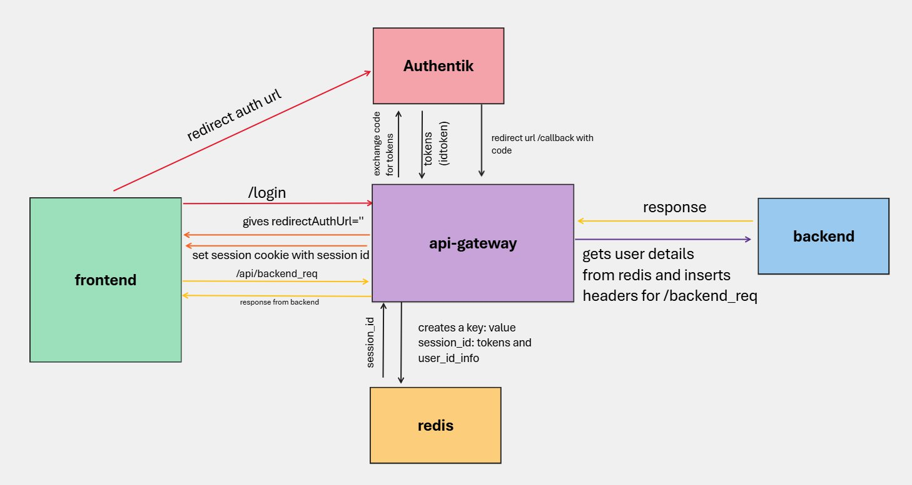

# API Get Away

A Backend-for-Frontend (BFF) and API Gateway built with Express 5 and Node.js (>=20.11). Handles OIDC authentication via Authentik, Redis-backed session management, and dynamic API proxying to backend services.



---

## Table of Contents

- [Features](#features)
- [Architecture](#architecture)
- [Request Flow](#request-flow)
- [Project Structure](#project-structure)
- [Getting Started](#getting-started)
  - [Prerequisites](#prerequisites)
  - [Installation](#installation)
  - [Environment Variables](#environment-variables)
  - [Proxy Configuration (Postgres)](#proxy-configuration-postgres)
  - [Running the Application](#running-the-application)
- [API Reference](#api-reference)
  - [Authentication Endpoints](#authentication-endpoints)
  - [User Info Endpoint](#user-info-endpoint)
  - [Proxy Endpoint](#proxy-endpoint)
  - [Admin Endpoints](#admin-endpoints)
  - [Health Check](#health-check)
- [Authentication Flow (OIDC + PKCE)](#authentication-flow-oidc--pkce)
- [Session Management](#session-management)
- [Token Refresh](#token-refresh)
- [API Proxying](#api-proxying)
  - [Routing Algorithm](#routing-algorithm)
  - [User Header Injection](#user-header-injection)
  - [WebSocket Proxying](#websocket-proxying)
- [Security](#security)
  - [Helmet](#helmet)
  - [CORS](#cors)
  - [Cookie Security](#cookie-security)
  - [CSRF Protection](#csrf-protection)
  - [Rate Limiting](#rate-limiting)
  - [Header Spoofing Prevention](#header-spoofing-prevention)
- [Backend Health Monitoring](#backend-health-monitoring)
- [Logging](#logging)
- [Docker Deployment](#docker-deployment)
- [Testing](#testing)
- [NPM Scripts](#npm-scripts)
- [License](#license)

---

## Features

- **OIDC Authentication** with PKCE (Proof Key for Code Exchange) via Authentik
- **Redis-backed sessions** with 8-hour rolling TTL
- **Automatic token refresh** when access tokens near expiry
- **Dynamic API gateway** routing requests to backends by `/api/<app-name>` path mapping
- **Authenticated user header injection** (`x-user-email`, `x-user-sub`, `x-user-name`) into proxied requests
- **Admin API** for live config updates, config reloading, and backend health inspection
- **Backend health monitoring** with periodic checks and downtime notifications
- **Security hardened** with Helmet, CORS, rate limiting, httpOnly cookies, and header spoofing prevention
- **Structured logging** with Pino (JSON in production, pretty-printed in development)
- **WebSocket proxying** with session-authenticated upgrades and user header injection
- **Docker-ready** with multi-service Compose (Redis + Postgres + BFF)
- **Static file serving** with HTML fallback for SPA frontends

---

## Architecture

The BFF sits between frontend clients and backend services. It authenticates users via OIDC, manages sessions in Redis, and proxies API requests to the appropriate backend while injecting trusted user identity headers.

```
                  ┌─────────────┐
                  │   Authentik  │
                  │  (OIDC IdP)  │
                  └──────┬───────┘
                         │
    ┌────────┐    ┌──────┴───────┐    ┌──────────────┐
    │ Client ├───►│  BFF / API   ├───►│  Backend A   │
    │  (SPA) │◄───┤   Gateway    │    └──────────────┘
    └────────┘    │              │    ┌──────────────┐
                  │   Express 5  ├───►│  Backend B   │
                  │   + Redis    │    └──────────────┘
                  └──────────────┘
```

---

## Request Flow

The Express middleware stack is ordered for correctness — proxy routes are mounted **before** body parsers to preserve raw request bodies for proxying.

1. **Helmet** — Security headers
2. **Pino HTTP** — Structured request logging
3. **Morgan** — HTTP logging (development)
4. **CORS** — Origin validation
5. **Cookie Parser** — Session cookie extraction
6. **Proxy Routes** (`/api/*`) — Mounted before body parsers
7. **JSON Body Parser** — 100KB limit
8. **URL-Encoded Body Parser** — Form submissions
9. **Rate Limiter** — 60 req/min on `/auth/` endpoints
10. **Static Files** — Serve `public/` with HTML fallback
11. **Route Handlers** — Auth, API, admin, health
12. **404 Handler** — `{"error": "Not Found"}`
13. **Global Error Handler** — Catch-all with 500 response

---

## Project Structure

```
src/
├── app.js                    # Express app with full middleware stack
├── server.js                 # HTTP server entry point
├── config/
│   ├── index.js              # Environment variable loading & schema
│   ├── postgresConfigStore.js # Postgres-backed gateway config persistence
│   └── proxyConfig.js        # DB config loading, validation, live reload
├── db/
│   └── postgres.js           # Postgres pool and schema helpers
├── routes/
│   ├── auth.js               # OIDC login, callback, logout
│   ├── api.js                # /whoami/me user info endpoint
│   ├── proxy_routes.js       # /api/* dynamic proxy middleware
│   ├── admin.js              # /admin config & health endpoints
│   └── health.js             # /health and /healthz liveness checks
├── middleware/
│   ├── requireAuth.js        # Session validation + auto token refresh
│   └── csrfCheck.js          # Origin/Referer CSRF validation
├── services/
│   ├── oidc.js               # Token exchange, ID token verification (JWKS), refresh
│   ├── sessionStore.js       # Redis session CRUD (8h rolling TTL, 10m state records)
│   ├── proxy.js              # Backend resolution & http-proxy-middleware setup
│   └── healthChecker.js      # Periodic backend health checks & notifications
└── utils/
    ├── logger.js             # Pino logger (JSON prod / pretty dev)
    └── crypto.js             # PKCE pair generation, random string utilities
```

---

## Getting Started

### Prerequisites

- **Node.js** >= 20.11
- **Redis** 7+
- **Authentik** (or any OIDC-compliant identity provider)

### Installation

```bash
git clone <repository-url>
cd api-gateway
npm install
```

### Environment Variables

Copy `.env.example` to `.env` and populate with your values:

```bash
cp .env.example .env
```

| Variable | Required | Default | Description |
|----------|----------|---------|-------------|
| `PORT` | No | `8080` | Server listen port |
| `APP_BASE_URL` | Yes | — | External BFF URL (used for redirects and Origin checks) |
| `NODE_ENV` | No | `development` | `development` or `production` |
| `LOG_LEVEL` | No | `info` | Pino log level |
| **Redis** | | | |
| `REDIS_HOST` | Yes | — | Redis hostname |
| `REDIS_PORT` | No | `6379` | Redis port |
| `REDIS_PASSWORD` | No | — | Redis password |
| **Postgres** | | | |
| `DATABASE_URL` | Yes | — | Postgres URL, usually injected from Vault (e.g., `postgresql://api_gateway:<pw>@postgres:5432/api_gateway`) |
| `DB_SCHEMA` | No | `api_gateway` | Schema used for gateway-owned tables |
| `CONFIG_BOOTSTRAP_PATH` | No | `config.yml` | Optional first-run seed file used only when the DB config row is empty |
| `DATABASE_POOL_MAX` | No | `10` | Max Postgres pool connections |
| **OIDC** | | | |
| `OIDC_ISSUER` | Yes | — | OIDC issuer URL |
| `OIDC_AUTHORIZATION_ENDPOINT` | Yes | — | Authorization endpoint |
| `OIDC_TOKEN_ENDPOINT` | Yes | — | Token endpoint |
| `OIDC_USERINFO_ENDPOINT` | Yes | — | Userinfo endpoint |
| `OIDC_JWKS_URI` | Yes | — | JWKS endpoint for ID token signature verification |
| `OIDC_CLIENT_ID` | Yes | — | OAuth2 client ID |
| `OIDC_CLIENT_SECRET` | Yes | — | OAuth2 client secret |
| `OIDC_REDIRECT_PATH` | Yes | — | Callback path (e.g., `/auth/callback`) |
| `OIDC_SCOPES` | No | `openid profile email offline_access` | OAuth2 scopes |
| `OIDC_REVOCATION_ENDPOINT` | No | — | Token revocation endpoint |
| `ID_TOKEN_MAX_AGE_SECONDS` | No | `0` (disabled) | Max allowed age of ID token during verification |
| `TOKEN_REFRESH_SKEW_SECONDS` | No | `60` | Refresh token if < N seconds to expiry |
| **Cookie** | | | |
| `SESSION_COOKIE_NAME` | No | `sid` | Session cookie name |
| `SESSION_COOKIE_DOMAIN` | No | — | Cookie domain (leave blank for host-only) |
| `SESSION_COOKIE_SECURE` | No | `true` | Require HTTPS for cookie |
| `SESSION_COOKIE_SAMESITE` | No | `none` | Cookie SameSite attribute (`Lax`, `Strict`, `None`) |
| **Security** | | | |
| `ALLOWED_ORIGINS` | No | — | Comma-separated extra allowed origins merged with the Postgres config |

### Proxy Configuration (Postgres)

The active gateway configuration lives in normalized Postgres tables under `DB_SCHEMA`. The tables are created automatically at startup:

| Table | Key Columns | Description |
|-------|-------------|-------------|
| `api_gateway_config` | `config_key`, `default_backend` | Singleton config row, currently keyed by `active` |
| `api_gateway_allowed_origins` | `config_key`, `origin`, `sort_order` | One CORS/frontend allowlist origin per row |
| `api_gateway_mappings` | `config_key`, `name`, `backend`, `sort_order` | One route mapping per row |

If `api_gateway_config` has no `active` row, the gateway seeds the normalized tables once from `CONFIG_BOOTSTRAP_PATH` (`config.yml` by default). After seeding, the admin UI and API write Postgres directly.

Existing deployments that still have legacy `allowed_origins` or `mappings` JSONB columns on `api_gateway_config` are migrated into the child tables on startup, then those legacy columns are dropped.

```json
{
  "defaultBackend": "http://backend-service:4070",
  "allowedOrigins": ["https://app.example.com", "https://admin.example.com"],
  "mappings": [
    { "name": "vocabuildary", "backend": "http://vocabuildary:8000" },
    { "name": "authentic-tracker", "backend": "http://tracker:3000" }
  ]
}
```

**Mapping fields:**

| Field | Required | Description |
|-------|----------|-------------|
| `name` | Yes | First path segment after `/api`, e.g. `/api/vocabuildary/*` |
| `backend` | Yes | Target backend URL to proxy to |

This config can be updated at runtime via the [Admin API](#admin-endpoints). Saves hot-refresh the in-memory CORS allowlist, route mappings, and backend health checker.

### Running the Application

**Development:**
```bash
npm run dev
```

**Production:**
```bash
NODE_ENV=production npm start
```

**Docker:**
```bash
docker-compose up
```

This starts both Redis 7 (with AOF persistence) and the BFF service.

---

## API Reference

### Authentication Endpoints

#### `GET /auth/login`

Initiates the OIDC authorization code flow with PKCE.

**Query Parameters:**

| Param | Required | Description |
|-------|----------|-------------|
| `next` | No | Post-login redirect path (must start with `/`) |
| `frontend_host` | No | Frontend origin for redirect; falls back to `Origin`/`Referer` headers |

**Response:** `302` redirect to the OIDC provider's authorization endpoint.

**Behavior:**
- Validates `frontend_host` against the allowed origins list
- Generates a PKCE code verifier/challenge pair and a nonce
- Creates a state record in Redis (10-minute TTL) with `codeVerifier`, `nonce`, `next`, and `returnToHost`
- Redirects to the OIDC authorization endpoint with `response_type=code`, `code_challenge`, `nonce`, and configured scopes

---

#### `GET /auth/callback`

Handles the OIDC provider callback after user authentication. The route path is configurable via `OIDC_REDIRECT_PATH`.

**Query Parameters:** `code`, `state` (provided by the OIDC provider)

**Response:** `302` redirect to `{returnToHost}{next}` (or `/` if no `next`).

**Behavior:**
1. Retrieves and deletes the state record from Redis
2. Exchanges the authorization code for tokens using the PKCE code verifier
3. Verifies the ID token (signature via JWKS, issuer, audience, nonce, expiry, issued-at)
4. Extracts user info (email, sub, name) from the ID token
5. Creates a session in Redis (8-hour rolling TTL)
6. Sets an httpOnly session cookie
7. Redirects to the frontend

**Error Responses:**
- `400` — Missing `state` or `code`
- `400` — Invalid or expired state
- `502` — ID token missing or verification failed

---

#### `POST /auth/logout`

Destroys the user session.

**Response:** `204 No Content`

**Behavior:**
- Deletes the session from Redis (best-effort)
- Clears the session cookie

---

### User Info Endpoint

#### `GET /whoami/me` (requires auth)

Returns the authenticated user's profile from the OIDC userinfo endpoint.

**Response:**
```json
{
  "sub": "user-uuid",
  "name": "Jane Doe",
  "email": "jane@example.com",
  "picture": "https://..."
}
```

**Error Responses:**
- `401` — Unauthorized (no valid session)
- `502` — Failed to fetch userinfo from OIDC provider

---

### Proxy Endpoint

#### `ALL /api/*` (requires auth)

All requests to `/api/*` are authenticated and proxied to the resolved backend service.

- The `/api` prefix is **stripped** before forwarding (e.g., `/api/v1/users` becomes `/v1/users`)
- Trusted user headers are injected into the request (see [User Header Injection](#user-header-injection))
- Timeout: 30 seconds
- On proxy error: `502 {"error": "bad_gateway", "message": "..."}`

See [API Proxying](#api-proxying) for routing details.

---

### Admin Endpoints

All admin endpoints require authentication via the `requireAuth` middleware.

#### `GET /admin/config`

Returns the current proxy configuration.

**Response:**
```json
{
  "defaultBackend": "http://backend:4070",
  "allowedOrigins": ["https://app.example.com"],
  "mappings": [{"name": "vocabuildary", "backend": "http://vocabuildary:8000"}]
}
```

---

#### `PUT /admin/config`

Replaces the active Postgres configuration.

**Request Body:** New configuration object with `defaultBackend` and `mappings[]`.

**Behavior:**
- Validates required fields (`defaultBackend`, `mappings` array)
- Writes to the normalized Postgres config tables under `DB_SCHEMA`
- Hot-refreshes the in-memory CORS allowlist and route mappings
- Refreshes health checker for new/changed backends

**Response:** `200 {"ok": true, "config": {...}}`

---

#### `POST /admin/config/reload`

Reloads the active config row from Postgres without writing.

**Response:** `200 {"ok": true, "config": {...}}`

---

#### `GET /admin/health`

Returns health status for all configured backends.

**Response:**
```json
{
  "http://backend:4070": {
    "status": "up",
    "lastUp": 1711612800000,
    "firstDownAt": null,
    "notifiedDown": false,
    "lastCheck": 1711612800000,
    "latencyMs": 45
  }
}
```

---

### Health Check

#### `GET /health` or `GET /healthz`

Simple liveness probe.

**Response:** `200 {"ok": true}`

---

## Authentication Flow (OIDC + PKCE)

```
 Client                    BFF                      Authentik (IdP)         Redis
   │                        │                            │                    │
   │  GET /auth/login       │                            │                    │
   │  ?next=/dashboard      │                            │                    │
   │───────────────────────►│                            │                    │
   │                        │  Generate PKCE pair        │                    │
   │                        │  + nonce + state           │                    │
   │                        │───────────────────────────────────────────────►│
   │                        │  Store state record (10m TTL)                  │
   │                        │◄───────────────────────────────────────────────│
   │  302 Redirect          │                            │                    │
   │◄───────────────────────│                            │                    │
   │                        │                            │                    │
   │  User authenticates    │                            │                    │
   │───────────────────────────────────────────────────►│                    │
   │                        │                            │                    │
   │  GET /auth/callback    │                            │                    │
   │  ?code=...&state=...   │                            │                    │
   │───────────────────────►│                            │                    │
   │                        │  Retrieve + delete state   │                    │
   │                        │───────────────────────────────────────────────►│
   │                        │◄───────────────────────────────────────────────│
   │                        │                            │                    │
   │                        │  Exchange code for tokens  │                    │
   │                        │  (with code_verifier)      │                    │
   │                        │───────────────────────────►│                    │
   │                        │  {access, refresh, id}     │                    │
   │                        │◄───────────────────────────│                    │
   │                        │                            │                    │
   │                        │  Verify ID token (JWKS)    │                    │
   │                        │  Check: sig, iss, aud,     │                    │
   │                        │  nonce, exp, iat           │                    │
   │                        │                            │                    │
   │                        │  Create session (8h TTL)   │                    │
   │                        │───────────────────────────────────────────────►│
   │                        │◄───────────────────────────────────────────────│
   │  302 Redirect          │                            │                    │
   │  Set-Cookie: sid=...   │                            │                    │
   │◄───────────────────────│                            │                    │
```

---

## Session Management

Sessions are stored in Redis with the following characteristics:

| Property | Value |
|----------|-------|
| **Key format** | `session:{sid}` |
| **TTL** | 8 hours (rolling — reset on each write) |
| **Session ID** | 24-byte cryptographically random base64url string |

**Session contents:**
- `access_token`, `refresh_token`, `id_token`
- `token_type`, `scope`
- `access_expires_at` (computed from `expires_in`)
- `created_at`
- `user` object (`email`, `sub`, `name`)

**State records** (used during OIDC flow):

| Property | Value |
|----------|-------|
| **Key format** | `state:{state}` |
| **TTL** | 10 minutes |
| **Contents** | `codeVerifier`, `nonce`, `next`, `returnToHost`, `createdAt` |

State records are deleted immediately after use during the callback.

---

## Token Refresh

The `requireAuth` middleware automatically refreshes tokens when the access token is within `TOKEN_REFRESH_SKEW_SECONDS` (default: 60) of expiry:

1. On each authenticated request, check if `access_expires_at` is within the skew window
2. If yes and a `refresh_token` exists, POST to `OIDC_TOKEN_ENDPOINT` with `grant_type=refresh_token`
3. Update the session in Redis with the new token set
4. If refresh fails, return `401 {"error": "Session expired"}` (forces re-login)

---

## API Proxying

### Routing Algorithm

When a request hits `/api/*`, the proxy resolves the target backend:

1. Extract the first path segment after `/api`, e.g. `/api/vocabuildary/words` -> `vocabuildary`
2. Find a Postgres-backed mapping whose `name` matches that segment
3. Return the matched mapping backend, otherwise `defaultBackend`

**Path rewriting:** The `/api/<mapping-name>` prefix is stripped. For example:
- `/api/vocabuildary/words` -> `/words`
- `/api/authentic-tracker/events` -> `/events`

### User Header Injection

Before proxying, the BFF:
1. **Strips** any client-provided `x-user-email`, `x-user-sub`, `x-user-name` headers (prevents spoofing)
2. **Injects** trusted values from the authenticated session:

| Header | Source |
|--------|--------|
| `x-user-email` | ID token `email` claim |
| `x-user-sub` | ID token `sub` claim |
| `x-user-name` | ID token `name` claim |

Backend services can trust these headers without performing their own authentication.

### WebSocket Proxying

WebSocket connections to `wss://your-host/api/*` are fully supported. The BFF handles WebSocket `upgrade` requests at the HTTP server level with the same authentication and header injection as regular HTTP requests.

**How it works:**

1. The client initiates a WebSocket connection to `wss://your-host/api/some-path` — the browser automatically sends the session cookie with the upgrade request
2. The server intercepts the `upgrade` event before it reaches Express (WebSocket upgrades bypass Express middleware)
3. The session cookie is parsed and validated against Redis
4. If unauthenticated, the upgrade is rejected with `401 Unauthorized` and the socket is destroyed
5. Client-provided `x-user-*` headers are stripped and trusted values from the session are injected
6. The `/api/<mapping-name>` prefix is stripped (same as HTTP proxy: `/api/vocabuildary/ws` becomes `/ws`)
7. The upgrade is forwarded to the resolved backend via the same routing algorithm as HTTP requests

**Client example:**

```javascript
// The browser sends the session cookie automatically
const ws = new WebSocket("wss://your-bff-host/api/ws/events");

ws.onopen = () => console.log("Connected");
ws.onmessage = (e) => console.log("Message:", e.data);
ws.onclose = (e) => console.log("Closed:", e.code, e.reason);
```

**Key details:**

| Property | Value |
|----------|-------|
| Path prefix | `/api/*` (same as HTTP proxy) |
| Authentication | Session cookie validated against Redis |
| User headers | `x-user-email`, `x-user-sub`, `x-user-name` injected |
| Path rewriting | `/api/<mapping-name>` prefix stripped before forwarding |
| Backend routing | Same app-name mapping algorithm as HTTP |
| Unauthenticated | Socket destroyed with `401` response |

**Note:** WebSocket upgrades bypass Express middleware entirely (including CORS, rate limiting, and body parsers). Authentication is handled directly in the `upgrade` event handler on the HTTP server. Backend services receive the same trusted `x-user-*` headers as they do for HTTP requests.

---

## Security

### Helmet

Security headers applied to all responses:

- `Cross-Origin-Opener-Policy: same-origin`
- `Cross-Origin-Resource-Policy: same-site`
- Plus all Helmet defaults: Content-Security-Policy, Strict-Transport-Security, X-Frame-Options, X-Content-Type-Options, etc.

### CORS

- Origins validated against Postgres `allowedOrigins` merged with the optional `ALLOWED_ORIGINS` env variable
- Credentials: enabled
- Allowed methods: `GET`, `POST`, `PUT`, `DELETE`, `PATCH`, `OPTIONS`
- Allowed headers: `Content-Type`, `Authorization`
- Requests with no `Origin` header (curl, server-to-server, same-origin navigation) are allowed through

### Cookie Security

| Attribute | Value |
|-----------|-------|
| `httpOnly` | `true` (no JavaScript access) |
| `secure` | `true` (HTTPS only) |
| `sameSite` | `none` (configurable; allows cross-site use) |
| `domain` | Configurable via `SESSION_COOKIE_DOMAIN` |
| `path` | `/` |

### CSRF Protection

A CSRF middleware (`csrfCheck.js`) is available that validates `Origin` and `Referer` headers against the allowed origins list for unsafe HTTP methods (POST, PUT, DELETE, PATCH). It can be mounted in the middleware stack as needed.

### Rate Limiting

Auth endpoints (`/auth/*`) are rate-limited to **60 requests per minute per IP** using `express-rate-limit`.

### Header Spoofing Prevention

Client-provided `x-user-*` headers are stripped from all proxied requests before trusted values from the session are injected. This prevents clients from impersonating other users.

---

## Backend Health Monitoring

The health checker service periodically monitors all configured backends:

| Setting | Value |
|---------|-------|
| **Check interval** | 60 seconds |
| **Method** | `HEAD` request |
| **Healthy status** | 2xx–3xx response |
| **Timeout** | 10 seconds per check |

**State tracked per backend:**
- `status` — `up`, `down`, or `unknown`
- `lastUp` — Timestamp of last successful check
- `firstDownAt` — When the current downtime started
- `latencyMs` — Response time (when up)
- `notifiedDown` — Whether a downtime notification has been sent

**Notifications:**
- Triggered when a backend has been down for **6 or more hours**
- Recovery notification sent when a backend comes back up (includes downtime duration)
- Sent via Apprise notification service

Health status is viewable via [`GET /admin/health`](#get-adminhealth).

---

## Logging

Logging uses [Pino](https://github.com/pinojs/pino) for structured, high-performance output:

| Environment | Format |
|-------------|--------|
| Production | JSON (machine-readable) |
| Development | Pretty-printed (human-readable via `pino-pretty`) |

Log level is configurable via the `LOG_LEVEL` environment variable (default: `info`).

**Key log points:**
- Server startup and port binding
- Backend health check results (up/down/recovery)
- Configuration changes via admin API
- Authentication errors (token exchange, verification, refresh failures)
- Proxy errors (bad gateway, timeouts)
- Unhandled rejections and uncaught exceptions

---

## Docker Deployment

### Dockerfile

- **Base image:** `node:20-alpine`
- **Install:** `npm ci --omit=dev` (production dependencies only)
- **User:** Runs as non-root `node` user
- **Port:** 5000
- **Entrypoint:** `npm start`

### Docker Compose

Starts three services:

**Redis:**
- Image: `redis:7-alpine`
- Persistence: AOF (Append-Only File) enabled
- Volume: `./redis_data:/data`
- Healthcheck: `redis-cli ping`

**Postgres:**
- Image: `postgres:15-alpine`
- Dev credentials: `api_gateway` / `api_gateway`
- Volume: `postgres_data:/var/lib/postgresql/data`
- Used for the active gateway config table

**BFF:**
- Built from local Dockerfile
- Depends on Redis and Postgres (waits for healthy)
- Mounts `config.yml` read-only only as an optional first-run seed
- Port: 5000
- Restart: `unless-stopped`

```bash
# Start both services
docker-compose up

# Start in background
docker-compose up -d

# Rebuild after code changes
docker-compose up --build
```

---

## Testing

Tests use [Vitest](https://vitest.dev/) with the Node environment and global test functions.

**Test files:**
- `tests/requireAuth.test.js` — Session validation and token refresh
- `tests/csrfCheck.test.js` — CSRF header validation
- `tests/app.test.js` — Middleware stack and 404 handling
- `tests/sessionStore.test.js` — Redis session CRUD
- `tests/proxyConfig.test.js` — Config loading and normalization
- `tests/proxy.test.js` — Proxy routing and header injection
- `tests/healthChecker.test.js` — Health checking and notifications
- `tests/admin.test.js` — Admin API endpoints
- `tests/auth.test.js` — OIDC auth flow

```bash
# Run tests once
npm test

# Run tests in watch mode
npm run test:watch
```

---

## NPM Scripts

| Script | Command | Description |
|--------|---------|-------------|
| `npm run dev` | `node src/server.js` | Start development server |
| `npm start` | `node src/server.js` | Start production server |
| `npm run lint` | `eslint .` | Run ESLint |
| `npm test` | `vitest run` | Run tests once |
| `npm run test:watch` | `vitest` | Run tests in watch mode |

---

## License

This project is licensed under the MIT License.
